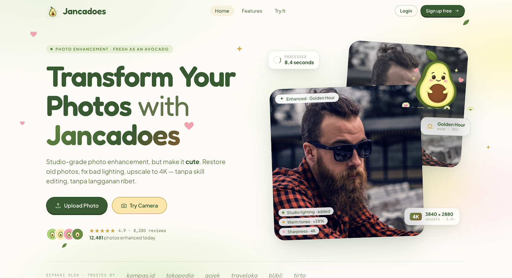

# Jancadoes

Studio-grade photo enhancement — restore, relight, upscale to 4K.



The frontend is a no-build static site: React + Babel are loaded from a CDN, so
the `.jsx` files run directly in the browser. The **Try it** flow calls a small
Node/Express backend (`server/`) that runs the photo through OpenAI
`gpt-image-2`, using the RAG prompt for the chosen mode (see `docs/rag.md`).

## Modes

Seven enhancement modes, each driven by a hand-tuned RAG prompt — plus
**Auto-pick**, where `gpt-5` chooses the best mode for your photo:

| # | Mode | What it does |
|---|------|--------------|
| 1 | Phone → Studio   | Studio lighting + clean background |
| 2 | Correct Lighting | Fix exposure, recover shadows |
| 3 | Golden Hour      | Warm portrait glow, soft skin tones |
| 4 | Restore Old      | Repair scratches, blur, and color fade |
| 5 | Remove People    | Clear background photo-bombs |
| 6 | Remove Watermark | Auto-detect + erase watermarks |
| 7 | 4K Enhancer      | Upscale resolution up to 4× with detail |

## Run it with Docker (recommended)

The API key is read from `.env` (`GPT_OPENAPI_API_KEY=...`).

```sh
docker compose up --build
```

Then open <http://localhost:8000>.

- `/` — the marketing **landing page**.
- `/app` — the **enhance workspace** (upload → mode → result). It requires a
  signed-in account; logging in from the landing page redirects here, and
  visiting `/app` while signed out bounces back to `/`.
- `docker compose down` to stop.
- `GET /api/health` reports whether the key + RAG prompts are wired up.
- Quality/size are tunable in `docker-compose.yml` (`IMAGE_QUALITY`, `IMAGE_SIZE`).

## Run it without Docker

```sh
npm install
GPT_OPENAPI_API_KEY=sk-... npm start
```

Open:

- <http://localhost:8000/jancadoes-ui.html> — the product UI
- <http://localhost:8000/jancadoes-wireframes.html> — the wireframe / design canvas

## Accounts

Enhancing a photo requires a (free) account — register or log in from the nav,
or straight from the **Try it** flow.

- `POST /api/register`, `POST /api/login`, `POST /api/logout`, `GET /api/me`.
- Accounts live in an embedded **SQLite** database (`data/jancadoes.db`), kept
  across rebuilds by the `./data` volume. Passwords are scrypt-hashed.
- Auth uses signed **JWTs** (HS256, 7-day expiry) — each token carries a
  unique `jti`; `iss`/`alg` are verified. Logout records the `jti` in the
  `revoked_tokens` table, so it stays revoked even after a restart.
- `register`/`login` are rate-limited (12 attempts / 15 min per IP).
- `POST /api/enhance` is gated: it returns `401` without a valid token.

## How enhancement works

1. The user signs in, then uploads a photo (file or live camera) + chosen mode
   to `POST /api/enhance` with a `Bearer` token.
2. `server/prompts.js` parses `docs/rag.md` — its 7 numbered sections map, in
   order, to the 7 modes (`studio`, `lighting`, `golden`, `restore`, `people`,
   `watermark`, `fourk`). The file is re-parsed automatically when it changes,
   and `docs/` is mounted into the container — so editing a prompt in
   `rag.md` takes effect on the next request, no rebuild or restart.
3. `mode=auto` first asks `gpt-5` (vision) to pick the best mode.
4. The image + RAG prompt go to OpenAI `images/edits` (`gpt-image-2`); the
   result is returned as a data URL and shown in the before/after comparison.

Models are overridable via env (`IMAGE_MODEL`, `AUTO_MODEL`); inputs are
validated server-side — image MIME type, 25 MB limit, mode allow-list, and
length caps on auth fields.

## Structure

```
jancadoes/
├── jancadoes-ui.html          # entry point — marketing landing page (/)
├── app.html                   # entry point — enhance workspace (/app)
├── jancadoes-wireframes.html  # entry point — wireframes
├── .design-canvas.state.json  # persisted canvas state (read by design-canvas.jsx)
├── .env                       # GPT_OPENAPI_API_KEY (not baked into the image)
├── Dockerfile                 # static site + enhance API in one container
├── docker-compose.yml         # build + run, reads .env
├── package.json               # express + multer
├── server/
│   ├── server.js              # static serving + auth + POST /api/enhance
│   ├── auth.js                # register / login / JWT sessions
│   ├── db.js                  # embedded SQLite connection + schema
│   └── prompts.js             # parses docs/rag.md into the mode prompt library
├── data/                      # jancadoes.db — created at runtime (volume)
├── src/
│   ├── styles/                # ui-tokens.css, ui-layout.css
│   ├── ui/                    # product UI components (ui-*.jsx)
│   ├── wireframes/            # wireframe screens + design canvas
│   └── shared/                # auth.jsx + tweaks-panel.jsx
├── assets/                    # favicon + mascot icon
└── docs/                      # rag.md — RAG prompt reference
```

Entry HTML files stay in the root because the `assets/` paths and
`.design-canvas.state.json` are resolved relative to the document.
